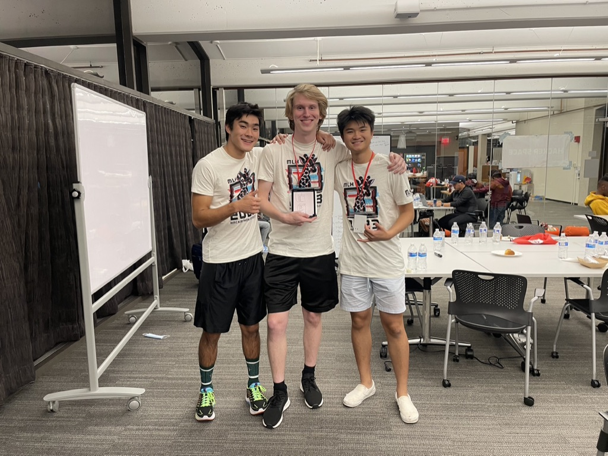

#                                                         🛠 Hack Harvard 2022 Ctrl Alt Create 🛠

# 🎵 Dynamic Playlist Curation 🎵

  

---

## 🌟 Highlights

- Mobile application
- Flutter SDK, Dart as Frontend and Python as Backend
- Uses Spotify REST API
- Facial recognition machine learning model to discern a person's emotional state
- Playlist assorted based on emotional state, current time, weather, and location metrics

---

## ℹ️ Overview

Some days might feel like nothing but good vibes, while others might feel a bit slow. Through it all, music has been by your side to give you an encompassing experience. Using the Dynamic Playlist Curation (DPC) app, all you have to do is snap a quick pic of yourself, and DPC will take care of the rest! The app analyzes your current mood, and incorporates other metrics like the current weather and time of day to determine the best songs for your current mood. It's a great way to discover songs that sound just right at the right time. We hope you'll enjoy the 10-song playlist that we've created especially for you!

---

### ✍️ Hackers

Rishi Parpyani
> _Information Systems Graduate Student at Northeastern University_

Ivan Khramtchenko
> _Computer Science major at Boston University_

Jason Li
> _Computer Engineering major at Boston University_

Andrew Sasamori
> _Computer Engineering major at Boston University_

---

### 🚀 Usage

* Made specifically for Spotify

---

